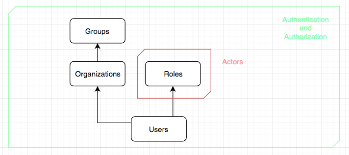

# DEPRECATION NOTICE

This repository is abandoned. At the moment on writing this, dependabot have reported several vulnerabilities:
- CVE-2020-10663
- CVE-2020-8130
- CVE-2020-8184
- CVE-2019-18978
- CVE-2019-15587
and much more. 

You are discouraged to use this repository.

# apid-tango

Boilerplate to start Rails API projects

### Overview

The purpose of this project is cover the common registration and authentication features in a web application. This project assumes that there are three kind of roles envolved (suppliers, clients and operations), every user will have one or multiple roles.

JWT with RS256 algorithm is used for creating access tokens that assert some number of claims:
- iss: user public id
- exp: token expiration
- jti: associated jti token public id
- aud: user main role (portal redirections)

This project serves the next ones endpoints:
- POST /registration : For user creation
- POST /auth : For login authentication
- PATCH /auth : For refresh token

TODO: Add first authorization steps with pundit

### Diagram



### Setup

Exist a bundle of scripts whose purpose are help us to interact with the dockerized app.

1. Build application image
```
./run.sh build
```
2. Run tests commands
```
# Run tests
./run.sh test

# Test database setup
./run.sh test setup   
```
3. Run dev commands
```
# open shell
./run.sh dev sh

# run rails console
./run.sh dev console

# run dev server
./run.sh dev server
```
4. Run commands for linters
```
# run rubocop and reek
./run.sh lint

# run rubocop
./run.sh lint rubocop

# run reek
./run.sh lint reek
```

